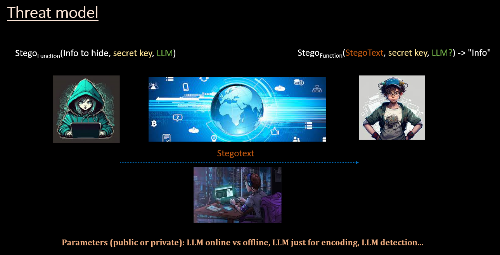

# WhisperLLM: Evading network security and censhorship by stegotexts

Over the last 10 years, many threat groups have employed stegomalware or other steganography-based techniques to attack organizations from all sectors and in all regions of the world. Some examples are: APT15/Vixen Panda, APT23/Tropic Trooper, APT29/Cozy Bear, APT32/OceanLotus, APT34/OilRig, APT37/ScarCruft, APT38/Lazarus Group, Duqu Group, Turla, Vawtrack, Powload, Lokibot, Ursnif, IceID, etc. To mitigate the impact of these attacks different proposals have been published. In Blackhat USA 2022 and BH ASIA 2023 we released the [Stegowiper](https://github.com/mindcrypt/stegowiper) tool that tries to reduce the success of these campaigns.

However, offensive capabilities are necessary in many scenarios and in some of them are related to enhanced privacy capabilities and censorship-resistant mechanisms.

This tool makes use of LLM to generate stegotexts in various languages (e.g., English) to hide useful information that may go unnoticed. Due to the nature of natural language texts and their wider dispersion, this can be an interesting approach and more difficult to override.

## Threat model

The tool makes use of an LLM to hide the desired information. Depending on the technique used, the receiver would also need the LLM to retrieve the information. To facilitate the deployment of the tool in offensive environments with the smallest possible detection footprint the receiver will not need, with the implemented technique, the LLM to decode the information.

## How works. How much information can be hidden?

The technique has been designed to generate texts with a very good linguistic quality. The larger the text, the greater the number of errors that would require a correction process that could take some time. In our tests, and for practical scenarios, the tool proves useful in the order of __a few hundred bits__ and a __few thousand bits__. This amount is adequate for exchanging configuration information (e.g. in a command & control model), location information (IPs, emails, URIs, TOR addresses, ...), cryptographic keys, etc.

_IPv4/IPv6 (32/128 bits)_

_Cryptographic keys (128-4096 bits)_

_Seed (random number) (48-128 bits)_

_Phone number (44 bits...)_

_Urls compacted (5 char->40 bits)_

_Text in wide sense: 2000 hidden bits/6bits char = 333 hidden chars_

_GPS coordinates (latitude/longitude) (80 bits...)_

_TOR address / TOR services hidden (96 bits...)(6bits char)_

_Url 56 char -> 336 bits_

## Usage & Parameters

## Future work. Doing

We have studied numerous LLMs and currently the one that gives the best results is GPT-4, which is the one we use in the tool. Currently, we are implementing Mixtral and Llama2 in the tool to have LLM models that can be run locally.
