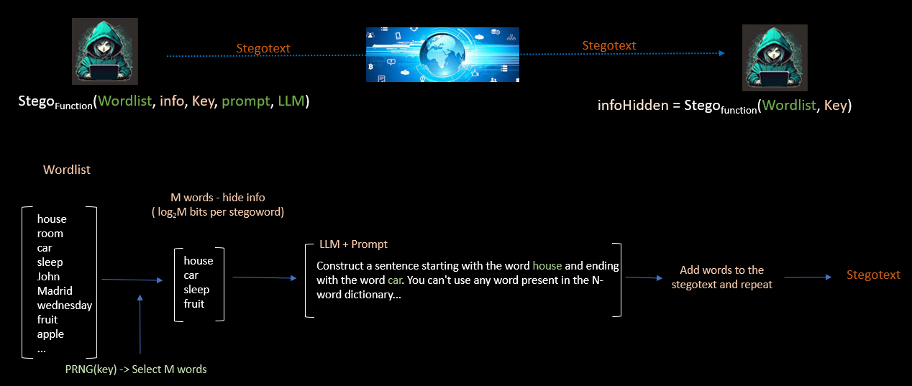

# WhisperLLM - Evading network security and censhorship by stegotexts

Over the last 10 years, many threat groups have employed stegomalware or other steganography-based techniques to attack organizations from all sectors and in all regions of the world. Some examples are: APT15/Vixen Panda, APT23/Tropic Trooper, APT29/Cozy Bear, APT32/OceanLotus, APT34/OilRig, APT37/ScarCruft, APT38/Lazarus Group, Duqu Group, Turla, Vawtrack, Powload, Lokibot, Ursnif, IceID, etc. To mitigate the impact of these attacks different proposals have been published. In Blackhat USA 2022 and BH ASIA 2023 we released the [Stegowiper](https://github.com/mindcrypt/stegowiper) tool that tries to reduce the success of these campaigns.

However, offensive capabilities are necessary in many scenarios and in some of them are related to enhanced privacy capabilities and censorship-resistant mechanisms.

This tool makes use of LLM to generate stegotexts in various languages (e.g., English) to hide useful information that may go unnoticed. Due to the nature of natural language texts and their wider dispersion, this can be an interesting approach and more difficult to override.

## Threat model

The tool makes use of an LLM to hide the desired information. Depending on the technique used, the receiver would also need the LLM to retrieve the information. To facilitate the deployment of the tool in offensive environments with the smallest possible detection footprint the receiver will not need, with the implemented technique, the LLM to decode the information.

## How much information can be hidden?

The technique has been designed to generate texts with a very good linguistic quality. The larger the text, the greater the number of errors that would require a correction process that could take some time. In our tests, and for practical scenarios, the tool proves useful in the order of __a few hundred bits__ and a __few thousand bits__. This amount is adequate for exchanging configuration information (e.g. in a command & control model), location information (IPs, emails, URIs, TOR addresses, ...), cryptographic keys, etc.

_IPv4/IPv6 (32/128 bits)_

_Cryptographic keys (128-4096 bits)_

_Seed (random number) (48-128 bits)_

_Phone number (44 bits...)_

_Urls compacted (5 char->40 bits)_

_Text in wide sense: 2000 hidden bits/6bits char = 333 hidden chars_

_GPS coordinates (latitude/longitude) (80 bits...)_

_TOR address / TOR services hidden (96 bits...)(6bits char)_

_Url 56 char -> 336 bits_

## How works the algorithm & tool

1. Select a very large dictionary of words in the desired language in which we want to create the stegotext.

2. Sender and receiver share a key

3. The key is used to generate 256-word dictionaries at random. There will be as many different dictionaries as there are words generated that hide information.

4. Each dictionary has 256 words. Therefore, 2^8=256. Each word can encode by its index in the table (dictionary) a value of 8 bits.

5. We take the information to be hidden and we cut it into blocks of 8 bits.

6. The first 8-bit block is used to select a word from the first dictionary. The 8 bits are the index that will allow to read the concrete word of the dictionary. This process is repeated until we have generated enough words to mask the information to be hidden. In each new iteration there will be a new block of 8 bits and a new random dictionary.

7. The result will be N words that make the stegotext. For example, if we want to hide 32 bits we would need to create 4 stego-words (8*4=32).

8. The resulting stegotext hides information but has no linguistic meaning (neither syntactic, semantic, coherence, etc). We will use an LLM to correct this.

9. Using an LLM we enter the following prompt. I want you to create a meaningful text using the N generated words. The conditions will be simple: you have to use the words in order without modifying them. Between two words you can enter as many words as you want with the only condition that the selected words can not be in the dictionary of the word that the receiver expects to decode. If the LLM is able to do this, the text will have human validity and the receiver will not need the LLM to retrieve the hidden information. For example, give the word __house__ and __truck__. The resulting stegotext can use any number of words between __house__ and __truck__ with the only condition that _it cannot use any word from the dictionary from which the word truck was extracted_.

10. how to decode. The receiver needs to use the same large dictionary words to generate the specific dictionaries. The concept "large" does not mean a huge file, a few thousand words might be enough.

11. The receiver receives a potential stegotext. With the key shared with the sender, it generates a sufficient number of dictionaries to try to retrieve the information.

12. The receiver generates the first dictionary containing 256 words. It starts reading the stegotext. If it finds any word in the dictionary it extracts its index (that will be the hidden information), if the word is not present in the dictionary it discards it.

13. If it has found a word in the first dictionary, it generates a second dictionary and continues reading the stegotext to detect any word present in the dictionary. If it finds it, it extracts its index (the hidden information), otherwise it discards the word and continues reading. This process is repeated until the stegotext is finished and the information is retrieved.

14. Thanks to the dictionaries and the process of discarding words, the receiver does not need to know the LLM to retrieve the hidden information.

## Usage & Parameters

Tool soon...

## Examples

## Limitations

LLM models sometimes do not respond properly to the instructions given, so it is necessary to vary the prompts and make the appropriate software corrections in order to have quality stegotexts. We are currently working on automating the solution of the most probable problems.

## Future work. Doing

We have studied numerous LLMs and currently the one that gives the best results is GPT-4, which is the one we use in the tool. Currently, we are implementing Mixtral and Llama2 in the tool to have LLM models that can be run locally.
